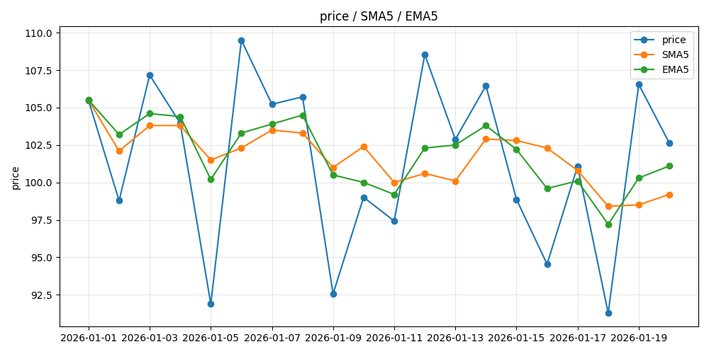

# 移动平均线 (Moving Average, MA)

> **配套代码**：`python_study\ma_test.py`
> **覆盖**：Day 1 – Day 4
> **本文档不用 LaTeX**：公式最终要写成代码，写成 `\frac{}{}` 只会多绕一道弯，
> 还逼你去装渲染插件。能用眼睛读懂、能直接抄进代码，才算好笔记。

## 目录

- [一、一句话](#一一句话)
- [二、公式](#二公式)
- [三、手算验算](#三手算验算)
- [四、为什么前 4 行不是 5 日均线](#四为什么前-4-行不是-5-日均线)
- [五、两条线的权重差在哪](#五两条线的权重差在哪)
- [六、Day 3 验收题：哪条线反应更快？为什么](#六day-3-验收题哪条线反应更快为什么)
- [七、必须理解的三个点](#七必须理解的三个点)
- [八、常见坑](#八常见坑)
- [九、Python 实现](#九python-实现)
- [十、我还没搞懂的问题](#十我还没搞懂的问题)

---

## 一、一句话

把最近 n 天的价格加起来除以 n。目的不是预测未来，而是把每天乱跳的价格压成一条能看出方向的线。

---

## 二、公式

### 2.1 简单移动平均线 SMA

    SMA(n) 在 t 时刻 = (P(t) + P(t-1) + P(t-2) + ... + P(t-n+1)) / n

    读法：从今天往回数 n 个价格（含今天），全部加起来，除以 n。
    符号意思：
      P(t)  = 第 t 天的价格，通常取收盘价
      n     = 窗口长度，也就是"几天均线"

    以 n = 5 为例，展开写就是：
      SMA5(t) = (P(t) + P(t-1) + P(t-2) + P(t-3) + P(t-4)) / 5

### 2.2 指数移动平均线 EMA

    EMA(t) = α × P(t) + (1 - α) × EMA(t-1)

    α = 2 / (n + 1)      （α 读作 alpha，叫平滑系数）

    读法：今天的 EMA = 今天价格的 α 倍 + 昨天 EMA 的 (1-α) 倍。
    和 SMA 的区别：SMA 里 5 个价格权重都是 1/5，一样重；
                   EMA 里越新的价格权重越大，所以 EMA 反应更快。
                   n 越大 → α 越小 → 越平滑、越迟钝。

---

## 三、手算验算

**能自己手算对上一次，就说明你真的懂这个指标了。这一步比看懂任何公式都重要。**

下面的数字全部来自 `python_study\ma_test.py` 的输出，不是随便编的。

### 3.1 SMA 手算

    日期         价格        SMA5(round 1位)
    2026-01-01   105.48      105.5
    2026-01-02    98.78      102.1
    2026-01-03   107.17      103.8
    2026-01-04   103.95      103.8
    2026-01-05    91.88      101.5     ← 第一个"真正的"5日均线
    2026-01-06   109.51      102.3

手算 2026-01-05 这一行：

    105.48 + 98.78 + 107.17 + 103.95 + 91.88
    = 507.26
    507.26 / 5 = 101.452  → 保留 1 位 = 101.5   ✅ 和 pandas 输出一致

再验一行 2026-01-06（窗口整体往后挪一天）：

    98.78 + 107.17 + 103.95 + 91.88 + 109.51
    = 511.29
    511.29 / 5 = 102.258  → 102.3   ✅ 一致

> **记住窗口边界**：算 t 日的 SMA5，取的是 t-4 到 t（含当天），正好 5 个值。
> 差一格是最容易犯的错，以后换数据、换周期都要先确认这个。

### 3.2 EMA 手算

起始条件：`adjust=False` 时，第 1 天的 EMA 直接等于第 1 天的价格 —— EMA(1) = 105.48。

    α = 2 / (5 + 1) = 1/3 ≈ 0.3333，　1 - α = 2/3 ≈ 0.6667

第 2 天：

    EMA(2) = 0.3333 × 98.78 + 0.6667 × 105.48
           = 32.9267 + 70.3200
           = 103.2467   →  保留 1 位 = 103.2   ✅ 和脚本输出一致

第 3 天（关键：拿「没取整」的 103.2467 往下算，不是 103.2）：

    EMA(3) = 0.3333 × 107.17 + 0.6667 × 103.2467
           = 35.7233 + 68.8311
           = 104.5544   →  104.6   ✅ 一致

第 4、5 天同理：

    EMA(4) = 0.3333 × 103.95 + 0.6667 × 104.5544 = 104.3530  →  104.4   ✅
    EMA(5) = 0.3333 ×  91.88 + 0.6667 × 104.3530 = 100.1953  →  100.2   ✅

> 「拿没取整的值往下算」这句，就是学习日志里那个发现的数学版本。
> 每步都 round 一次，误差会顺着递推式一层层放大，最后就和 pandas 对不上。

---

## 四、为什么前 4 行不是 5 日均线

注意 2026-01-01 到 01-04 这 4 行的 SMA5 分别是 105.5 / 102.1 / 103.8 / 103.8，
它们其实只是"前 1、2、3、4 个价格的平均"，不是 5 日均线。

原因在 `ma_test.py` 里的这个参数：

    prices.rolling(window=5, min_periods=1).mean()
                                ^^^^^^^^^^^^^

    min_periods=1 的意思是：只要凑够 1 个数就先算，不够 5 个也硬算。

如果去掉它，只写 `rolling(window=5)`，那么前 4 行会变成 NaN（Not a Number），
因为 pandas 认为"数据不够，拒绝计算"。

    哪种更对？
    NaN 更诚实 —— 它明确告诉你"这里还没有 5 日均线"。
    min_periods=1 更方便画图 —— 曲线从第一天就有值，不会缺一段。
    回测里用哪个，取决于你的策略前 4 天到底有没有信号。**这是个要自己做决定的事，不是抄来的。**

---

## 五、两条线的权重差在哪

把 EMA 的递推式展开两层：

    EMA(t) = α·P(t) + (1-α)·[α·P(t-1) + (1-α)·EMA(t-2)]
           = α·P(t) + α(1-α)·P(t-1) + (1-α)²·EMA(t-2)

一直展下去，每个历史价格前面的系数是这样：

    数据            SMA5 的权重        EMA5 的权重
    今天  P(t)        0.200             0.3333
    昨天  P(t-1)      0.200             0.2222
    前天  P(t-2)      0.200             0.1481
          P(t-3)      0.200             0.0988
          P(t-4)      0.200             0.0658
    更早的数据        0.000（完全不看）   0.1318（还在影响）

（EMA5 那一列 = (1/3) × (2/3)^k，k = 0,1,2,3,4…）

**一句话记住：SMA 是五个人平分，EMA 是越新的说了算。**

---

## 六、Day 3 验收题：哪条线反应更快？为什么

### 结论

ema 对最新价格的反应更快，因为最新一天的权重比 sma 的权重更高。在 n 大于 1 的情况下，2/(n+1) 大于 1/n：

    EMA 最新一天的权重 = 2/(n+1)     n=5 时 = 0.3333
    SMA 最新一天的权重 = 1/n         n=5 时 = 0.2000

### 再往深一层

但是我认为 ema 的深层次表现上可能更为复杂一些，因为更早的数据会影响现在的 ema
（上面权重表最后一行：更早的数据还在贡献 0.1318，永远不为零）。
sma 的表现可能会更干净利落，但 ema 较为拖泥带水，各有优劣，后面使用时需牢记这点。

### 数字验证

从上面那张 20 行对比表里量一下：

    日期         价格      SMA5    EMA5    价格离SMA5   价格离EMA5
    2026-01-10   99.01    102.4   100.0      3.39         0.99
    2026-01-13  102.88    100.1   102.5      2.78         0.38

`2026-01-10` 价格离 sma 较远、和 ema 更近。我认为是因为 06、07、08 的极端值影响较大，
导致 sma 和价格的差值比较大，而 ema 更侧重于当日价格，所以差值比 sma 小。

> 窗口是含当天的前 5 天，即 01-06 ~ 01-10，所以是 **06 / 07 / 08** 这三天的高价在拽 SMA。

`2026-01-13` 我认为原因和表现和 01-10 差不多。

---

## 七、必须理解的三个点

1. **NaN 不是 bug。** 它是"数据不够，还轮不到我算"的表达方式。
   以后你会经常见到 NaN，见到先问"是不是窗口不够"，而不是先怀疑代码。

2. **窗口只往前看，绝不包含未来。**
   SMA5 在 t 日 = P(t)、P(t-1)、P(t-2)、P(t-3)、P(t-4)。
   如果哪天你写成用到 P(t+1)，那就叫**前视偏差**（look-ahead bias），
   回测收益会好看得离谱，实盘一分钱赚不到。**这是量化里最致命、也最不报错的 bug。**

3. **n 是"灵敏度"旋钮。**
   n 小 → 贴着一根价格线跑，灵敏但噪音多。
   n 大 → 平滑但滞后，趋势掉头时它半天才反应过来。
   没有"最好的 n"，只有"匹配你策略的 n"。以后讲到参数优化时再深挖。

---

## 八、常见坑

- **用哪个价格？** 通常用收盘价（close）。别中途换指标口径。
- **rolling 数的是"行数"，不是"自然天数"。** 如果中间有停牌、缺数据，
  它会把停牌前后的价格当成连续的几天来平均。真实数据要先处理缺失值。
- **MA 不是预测器。** 它只是"当下的过滤器"。指望均线告诉你明天涨跌，方向就错了。
- **round 的位置会影响结果。** 递推式（EMA）里每步都取整，误差会滚雪球。

---

## 九、Python 实现

### 9.1 完整代码

```python
import numpy as np
import pandas as pd
import matplotlib.pyplot as plt
from pathlib import Path
# ================================================================
# 第一部分：算指标 —— 这一段每一行都要懂
# ================================================================

# 1. 造 20 个价格（固定种子，保证每次运行结果一样）
rng = np.random.default_rng(seed=42)
prices = pd.Series(
    rng.uniform(90, 110, size=20).round(2),          # 90~110 之间取 20 个数
    index=pd.date_range("2026-01-01", periods=20, freq="D"),
    name="price",
)

# 2. SMA5：滚动窗口取平均
#    min_periods=1 = 数据不够 5 个也先算；去掉它，前 4 行会变成 NaN
sma5 = prices.rolling(window=5, min_periods=1).mean().round(1)

# 3. EMA5：指数移动平均
#    adjust=False = 用递推式 EMA(t) = α·P(t) + (1-α)·EMA(t-1)，其中 α = 2/(5+1)
ema5 = prices.ewm(span=5, adjust=False).mean().round(1)

# 4. 打印对比表
df = pd.DataFrame({"price": prices, "SMA5": sma5, "EMA5": ema5})
print(df)

# 5. 手写循环再算一遍 EMA，和 pandas 对拍 —— 证明自己真懂 α 在干什么
#    注意：每步都拿「没取整」的值往下递推，只在最后 round。
#          每步都 round 的话，误差会顺着递推式滚雪球，就和 pandas 对不上了。
alpha = 2 / (5 + 1)
ema_manual = [prices.iloc[0]]                        # 第一天：EMA = 第一个价格
for p in prices.iloc[1:]:
    ema_manual.append(alpha * p + (1 - alpha) * ema_manual[-1])
ema_manual = pd.Series(ema_manual, index=prices.index).round(1)

print("两种算法完全一致:", ema_manual.equals(ema5))

# ================================================================
# 第二部分：画图 —— 核心只有下面 3 行 plot，其它都是可删的外观
# ================================================================

fig, ax = plt.subplots(figsize=(10, 5))       # 画布大小，10×5 英寸

ax.plot(prices, label="price", marker="o")    # ← 核心：把三条线画上去
ax.plot(sma5, label="SMA5", marker="o")
ax.plot(ema5, label="EMA5", marker="o")

ax.legend()                     # 图例 —— 不加就分不清哪条是哪条，别删
ax.set_title("price / SMA5 / EMA5")
ax.set_ylabel("price")
ax.grid(alpha=0.3)              # 淡网格，纯粹为了好看，删掉不影响结果

fig.tight_layout()              # 别让标题被裁掉

fig.savefig(Path(__file__).with_name("ma.png"))
plt.show()                      # 弹窗显示
```

### 9.2 运行输出

```
             price   SMA5   EMA5
2026-01-01  105.48  105.5  105.5
2026-01-02   98.78  102.1  103.2
2026-01-03  107.17  103.8  104.6
2026-01-04  103.95  103.8  104.4
2026-01-05   91.88  101.5  100.2
2026-01-06  109.51  102.3  103.3
2026-01-07  105.22  103.5  103.9
2026-01-08  105.72  103.3  104.5
2026-01-09   92.56  101.0  100.5
2026-01-10   99.01  102.4  100.0
2026-01-11   97.42  100.0   99.2
2026-01-12  108.54  100.6  102.3
2026-01-13  102.88  100.1  102.5
2026-01-14  106.46  102.9  103.8
2026-01-15   98.87  102.8  102.2
2026-01-16   94.54  102.3   99.6
2026-01-17  101.09  100.8  100.1
2026-01-18   91.28   98.4   97.2
2026-01-19  106.55   98.5  100.3
2026-01-20  102.63   99.2  101.1
�����㷨��ȫһ��: True
```

> **怎么读这段输出**：前 21 行是 `print(df)` 打出的对比表（price / SMA5 / EMA5 三列），
> 最后一行 `两种算法完全一致: True` 是手写循环和 pandas 对拍的结果。
> 调试时先想清楚"我要看哪几个数"，别一口气全打出来，输出才看得清。

> **画图部分**：核心只有 3 行 `ax.plot(...)`。图例 `ax.legend()` 不能删（删了就分不清哪条是哪条）；
> 网格 `ax.grid()` 纯属好看，删了不影响结果。图会存成脚本所在目录下的 `ma.png`（代码里的 `Path(__file__)` 保证不管从哪运行都落在脚本旁边）。

---

### 9.3 从图上看到了什么（Day 4 验收）



sma 的波动相对来说比较平稳，看的是近五天的综合趋势，而 ema 的波动较大，因为最近一天价格的影响会更严重。
但是从另一个方面来说，sma 对最新一天的价格比较迟钝，而 ema 相对而言比较敏感。
但不管是 ema 还是 sma，都反映了其价格有向下的趋势。

用数字对一遍（整个 20 天）：

    指标      首日     末日     涨跌      日变动标准差   最大单日跳
    price    105.48  102.63   -2.85       8.976        17.63
    SMA5     105.50   99.20   -6.30       1.667         3.40
    EMA5     105.50  101.10   -4.40       2.245         4.20

    读法：
      涨跌   —— 三个都是负的 →「向下的趋势」这个判断，数字上站得住
      标准差 —— EMA5 (2.245) > SMA5 (1.667) →「ema 波动较大」也站得住
      最大跳 —— EMA5 (4.20) > SMA5 (3.40) → 遇到单日大跳时，EMA 反应更猛

> 这一节和第六节是同一件事的两种证据：
> 第六节用**表格里的数字**证明 EMA 更贴价格，这一节用**图**再确认一遍。
> 以后再遇到「两条线到底差在哪」，先看数字、再看图，两边都说得通，才算真懂。

---

## 十、我还没搞懂的问题

> 想到什么就写一行，不要现在去查。攒到周末一起解决。

1. Series 的用法还不太熟（`.rolling`、`.mean`、`.round` 这些是 Series 的方法还是 pandas 的？）——先记着，慢慢来。
2. 算法是理解了，但是要让我自己写出来还是很成问题，慢慢学习理解记忆吧。
